# Git Local Environment Setup (Windows)

In this article we will cover how to set up a local environment in order to use Git on your own Windows PC. Let's go through the steps and get you set up!

**What You Need:**

- Your own PC with Windows installed
- Basic knowledge to operate Command Prompt
- Text Editor (ie. Atom) (If you don't have Atom installed on your PC

**Note: This article is for Windows users.**

## 1. Installing Git

Firstly, let's install Git from [Git for Windows](https://gitforwindows.org/).

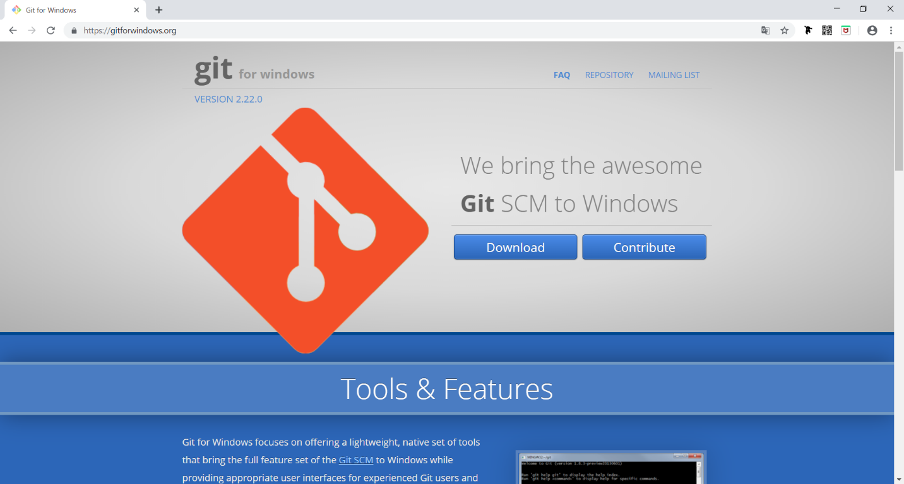

*Git for Windows*

After the download is complete, open the file and an installation screen will pop up. Let's follow the prompts and complete the installation.

**Step 1.** Once you agree to the terms and conditions, click "Next"

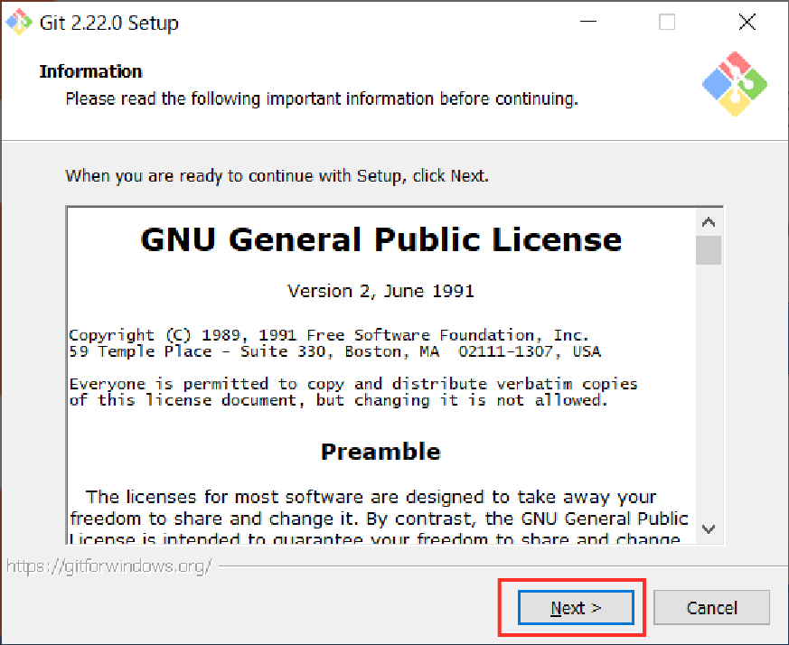

*Click "Next"*

**Step 2.** Click "Next"

*Click "Next"*

**Step 3**. Click "Next"

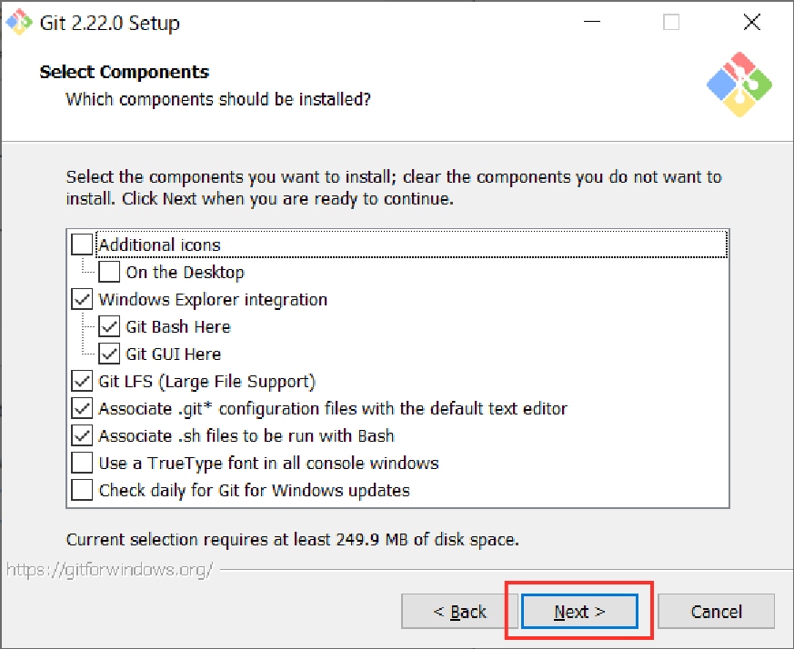

*Click "Next"*

**Step 4.** Click "Next"

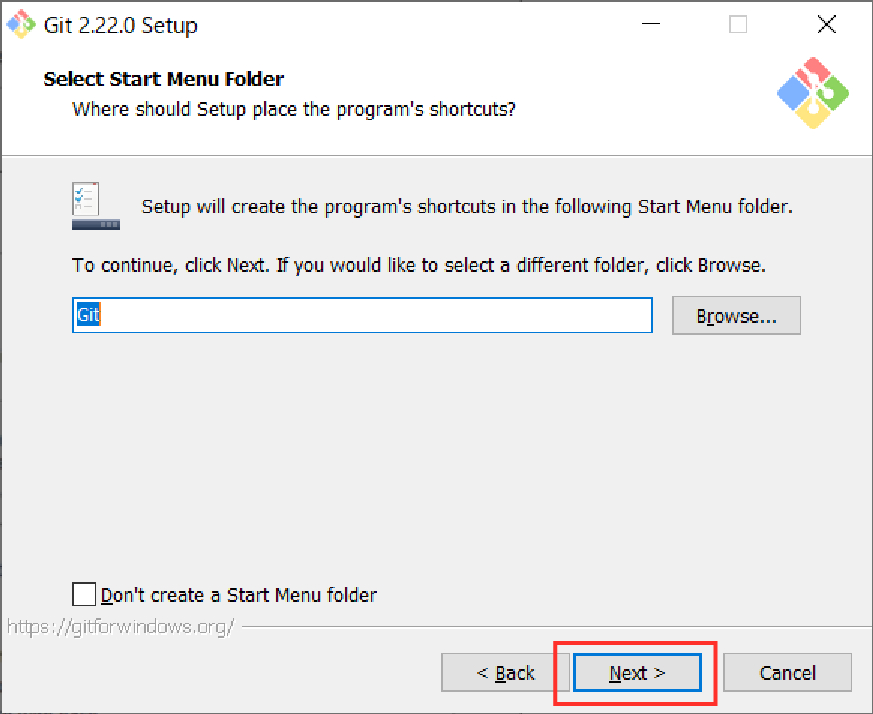

*Click "Next"*

**Step 5.** We must select the editor. Choose the editor that you will use and click "Next"

(The example below is for Atom)

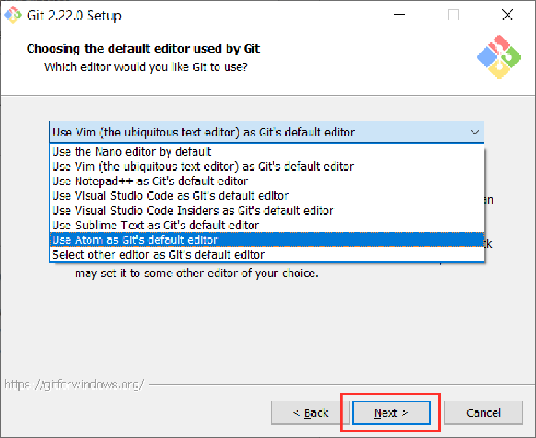

*Select the editor and click "Next"*

**Step 6.** Check "Use Git from Git Bash only" and click "Next"

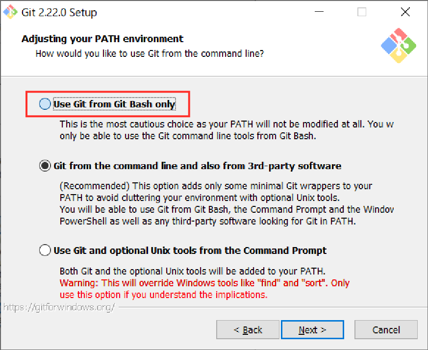

**Step 7.** Check "Use the OpenSSL Library" and click "Next"

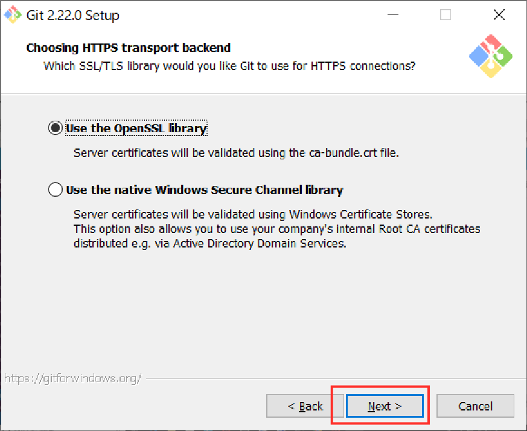

**Step 8.** Check "Checkout Windows-style, commit Unix-style line endings" and click "Next"

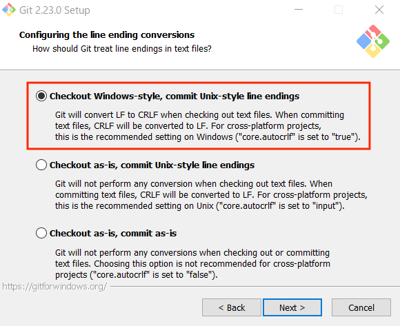

**Step 9.** Check "Use MinTTY (the default terminal of MSYS2)" and click "Next"

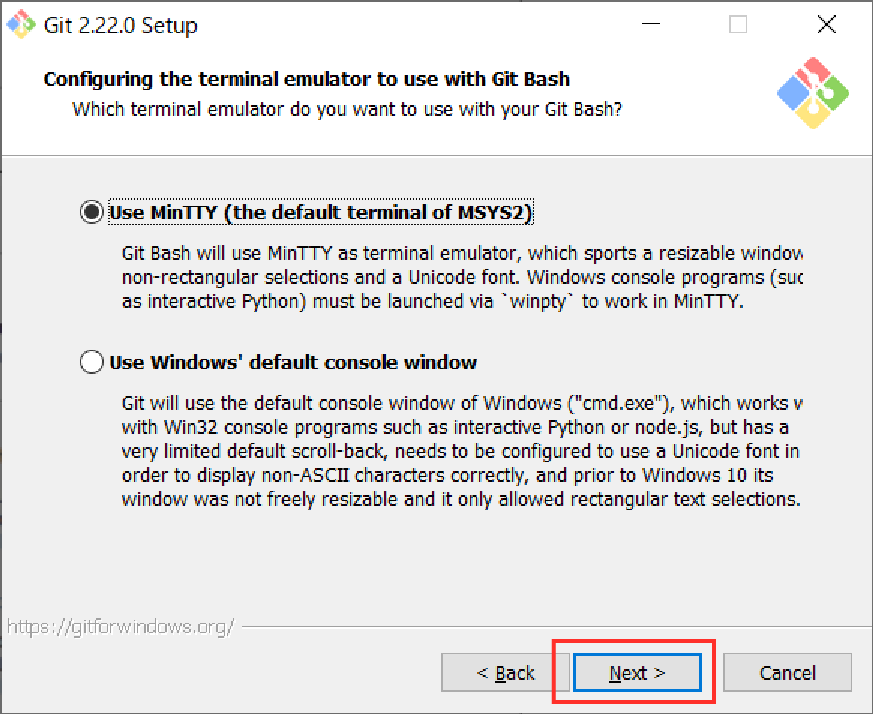

**Step 10.** Check all of the options and click "Next"

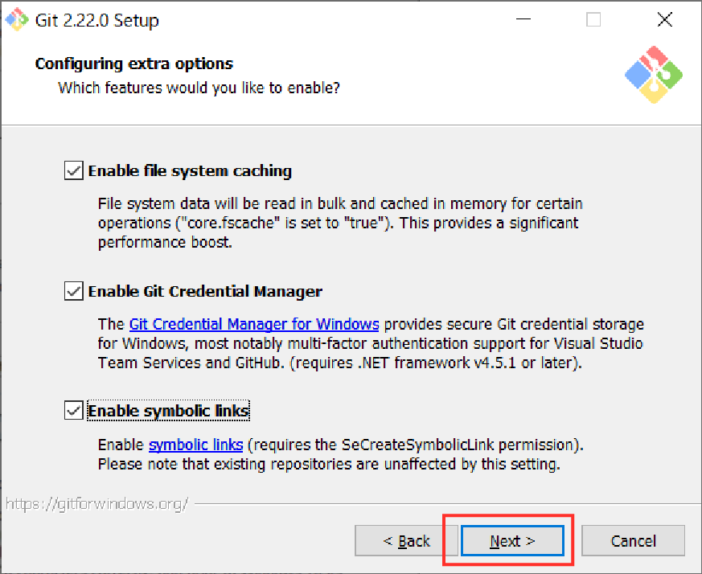

**Step 11.** Click "Install"

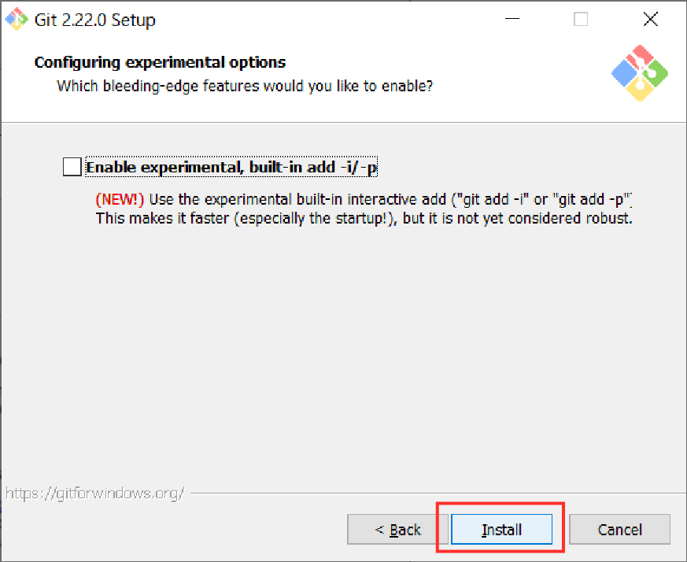

                                        Now the installation will complete.

**Step 12.** Click "Finish" and you will be able to start using Git!

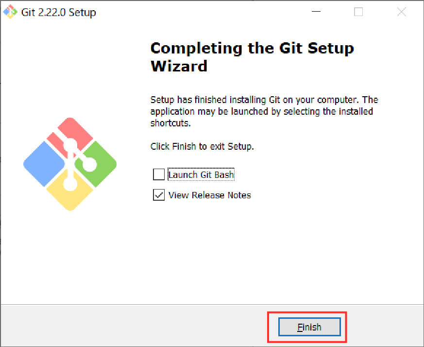

Now on your PC, there should be an application called **Git Bash** installed. This is a great tool to use for all your future development!

**Git Bash has been installed**

## 2. Initial Git Setup

First, let's open up **Git Bash**

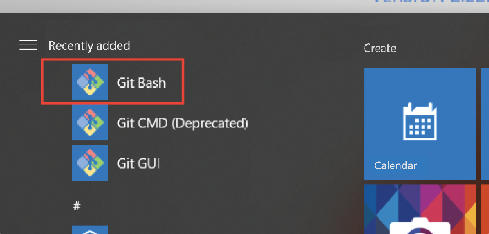

## 🥳🎉Successfully installed Git Bash Locally on Windows Machine