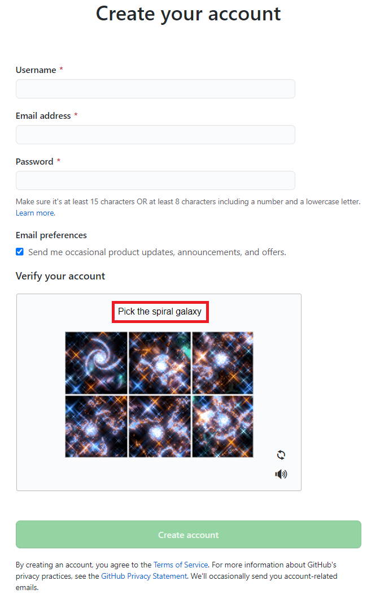
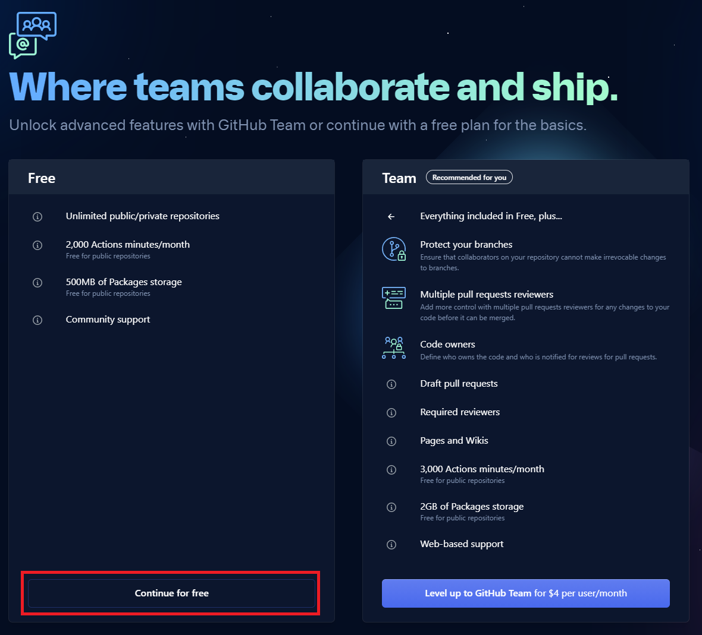
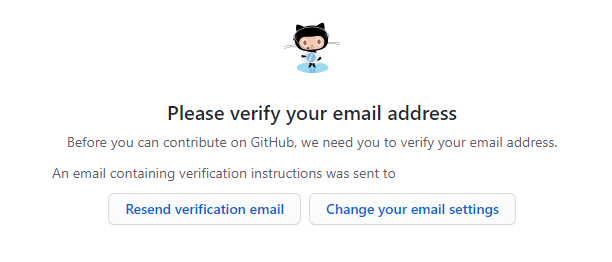

# GitHub Account Signup

### 1. **Setting up a GitHub account**

In order to utilize GitHub, let's make an account.

To create an account, visit the Github Official Page: **[Sign up](https://github.com/join)**

- Give Valid UserName
- Email
- Password
- And Verify the images then click on **Create Account**

*Then you access the below page*

### 2. Select the Highlighted Option

Then click on continue

### 3. Select the option as shown below

*then click on continue*.

### 4. Choose the free plan

### 5. Successfully GitHub Setup completed

Finally Verify your Email 

### 6. If you open your email you should get the similar email as shown below click on `Verify email address`

### 7. You should navigate to the below page

#### 🥳🎉Successfully GitHub Account Setup Completed